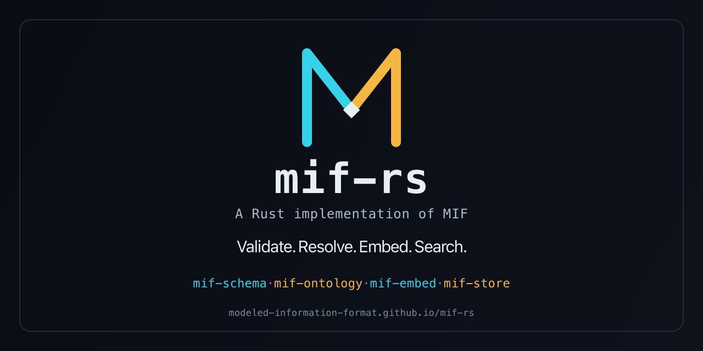

# mif-rs

<p align="center">
  
</p>

<!-- Badges -->
[](https://github.com/modeled-information-format/mif-rs/actions/workflows/pipeline.yml)
[](https://www.rust-lang.org/)
[](https://github.com/modeled-information-format/mif-rs/blob/main/LICENSE)
[](https://github.com/rust-lang/rust-clippy)
[](https://github.com/EmbarkStudios/cargo-deny)
[](https://github.com/gitleaks/gitleaks)
[](https://docs.github.com/en/code-security/dependabot)

Rust implementation of the [MIF (Modeled Information Format)](https://mif-spec.dev) specification.

## Crates

| Crate | Kind | Purpose |
|---|---|---|
| [`mif-core`](crates/mif-core) | library | Shared types: `OntologyReference`, `EntityReference`, `EntityData`, `ConceptType` |
| [`mif-schema`](crates/mif-schema) | library | JSON Schema validation of MIF documents, citations, and ontology definitions |
| [`mif-ontology`](crates/mif-ontology) | library | Three-tier ontology `extends` chain resolution |
| [`mif-problem`](crates/mif-problem) | library | RFC 9457 Problem Details error envelopes |
| [`mif-frontmatter`](crates/mif-frontmatter) | library | Markdown frontmatter <-> JSON-LD lossless round-trip |
| [`mif-embed`](crates/mif-embed) | library | Local sentence-embedding inference |
| [`mif-store`](crates/mif-store) | library | `SQLite` vector store for document embeddings |
| [`mif-cli`](crates/mif-cli) | binary | Command-line interface (`validate`, `ontology resolve`, `ingest`, `search`, `find-similar`, `corpus-stats`) |
| [`mif-mcp`](crates/mif-mcp) | binary | MCP server exposing the same six operations as tools |

## Installation

```bash
cargo add mif-core mif-schema mif-ontology mif-problem mif-frontmatter mif-embed mif-store   # libraries
cargo install mif-cli mif-mcp                 # binaries
```

## Quick start

```bash
mif-cli validate document.json
mif-cli ontology resolve grazing-plan --ontologies-dir ./ontologies
mif-cli ingest document.md --db-path .mif/vectors.db
```

```rust
let document: serde_json::Value = serde_json::from_str(&contents)?;
mif_schema::validate_document(&document)?;
```

## Development

[`just`](https://github.com/casey/just) is the local task runner. Run `just` to list all recipes.
Run `lefthook install` once after cloning to set up local git hooks mirroring
CI (`fmt`/`clippy`/`test` on commit/push).

```bash
just check            # Full CI check (fmt + clippy + test + doc + deny)
just build            # Debug build (workspace)
just test             # All tests
```

<details>
<summary>Raw cargo equivalents</summary>

```bash
cargo build --workspace
cargo test --workspace --all-features
cargo clippy --workspace --all-targets --all-features -- -D warnings
cargo fmt --all -- --check
cargo doc --workspace --no-deps --all-features
cargo deny check
```

</details>

## CI/CD and releases

CI (`pipeline.yml`, `quality-gates.yml`) runs formatting, lint, tests, docs,
supply-chain checks, and the org's SAST/SCA/Scorecard/Trivy gates on every
push and PR. Releases are tag-triggered (`release.yml`, `publish.yml`,
`package-homebrew.yml`) and produce SLSA-attested, multi-platform binaries
for both `mif-cli` and `mif-mcp`, plus crates.io publication via Trusted
Publishing. See [`docs/runbooks/RELEASING.md`](docs/runbooks/RELEASING.md)
for the full procedure and [`SECURITY.md`](SECURITY.md#verifying-release-artifacts)
for artifact verification commands.

See `CLAUDE.md` for full development conventions (lint configuration, error
handling, testing).

## Contributing

See [CONTRIBUTING.md](CONTRIBUTING.md) for development setup and coding
standards. Please also review [CODE_OF_CONDUCT.md](CODE_OF_CONDUCT.md),
[SECURITY.md](SECURITY.md), and [GOVERNANCE.md](GOVERNANCE.md).

## MSRV policy

The Minimum Supported Rust Version (MSRV) is **1.92**. Raising the MSRV is a
minor breaking change.

## License

MIT — see [LICENSE](LICENSE).
